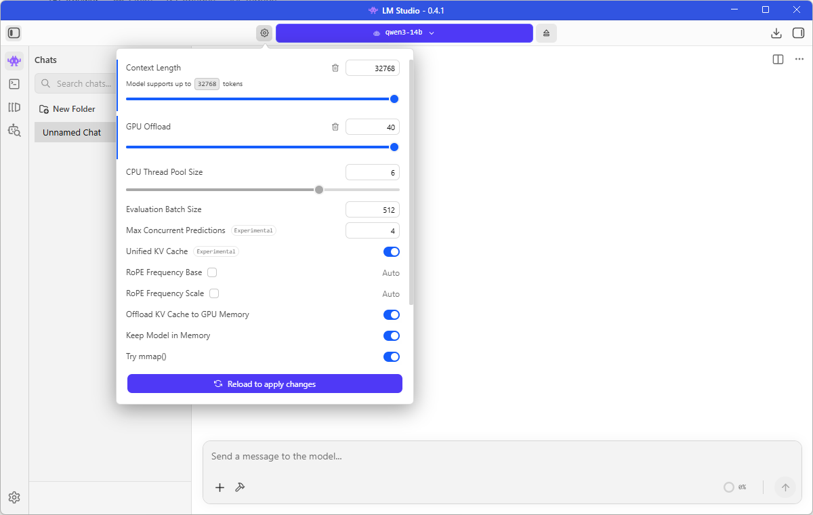
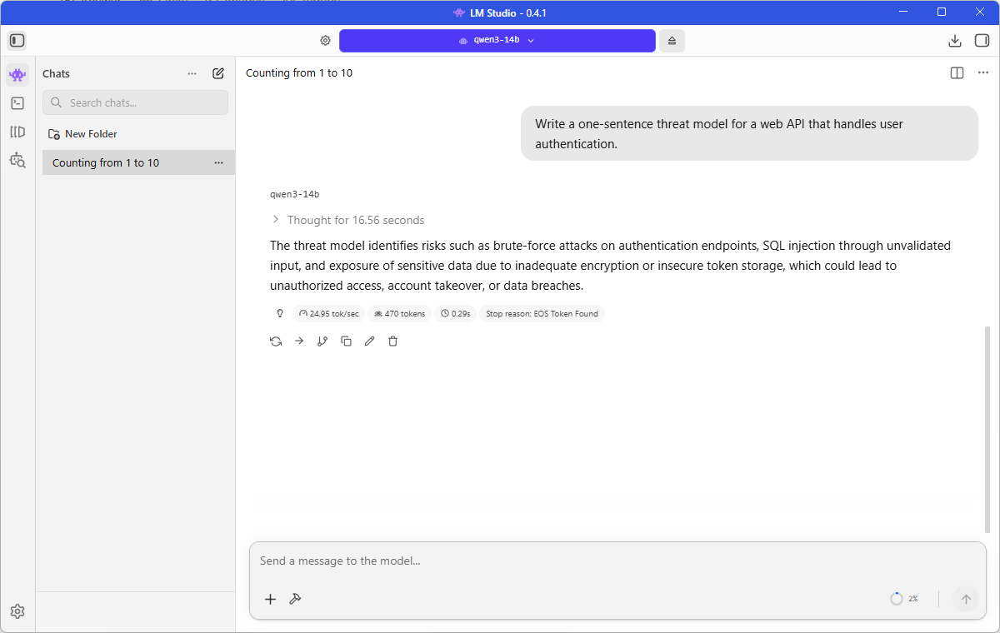
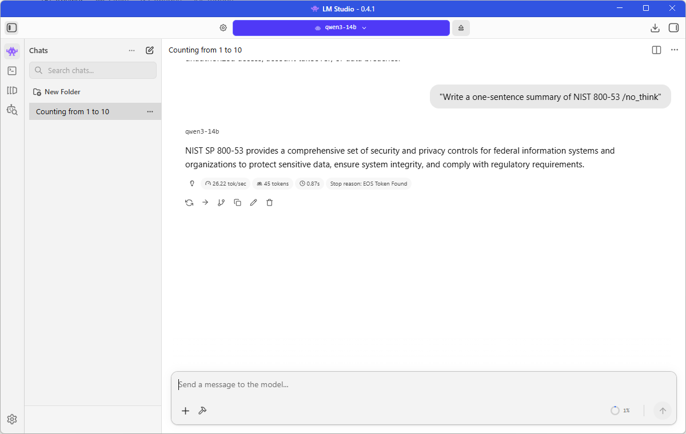

> **Offline-first local LLM setup for GRC and Security Analyst work** (threat modeling, compliance documentation, policy drafting, and IR planning) designed to reduce third‑party data exposure.

---

## Contents
- [Project goal](#project-goal)
- [System specifications](#system-specifications)
- [Offline assurance](#offline-assurance)
- [Model provenance (supply chain)](#model-provenance-supply-chain)
- [Evidence (proof of execution)](#evidence-proof-of-execution)
- [Setup guide (step-by-step)](#setup-guide-step-by-step)
- [Security hardening (OWASP LLM Top 10 2025)](#security-hardening-owasp-llm-top-10-2025)
- [GRC & Security use cases](#grc--security-use-cases)
- [Known limitations](#known-limitations)
- [License & professional disclaimer](#license--professional-disclaimer)
- [Related files](#related-files)

---

## 🎯 Project goal

**Requirement:** Run a reasoning-capable LLM locally to support GRC/security workflows while minimizing data-exposure risk.

**Target roles:** GRC Analyst, Cybersecurity Analyst, Compliance Analyst

**Primary deliverables:**
- Threat models
- Risk statements / risk register entries
- Control mappings
- Policy drafts
- Incident response checklists
- Vendor security questionnaires

---

## 🖥️ System specifications

### Hardware
- **CPU:** AMD Ryzen 7 3700X (8-Core)
- **RAM:** 32GB DDR4
- **GPU:** AMD Radeon RX 6700 XT (12GB VRAM)
- **OS:** Windows 11
- **Storage:** Plan ~20GB free (model file + app cache/runtimes + screenshots)

### Software stack (this build)
- **Client:** LM Studio 0.4.1
- **Backend:** Vulkan
- **Model (GGUF):** `lmstudio-community/Qwen3-14B-GGUF` [Source: HF listing]
- **Quantization used (this workstation):** `Q4_K_M`
  - **File:** `Qwen3-14B-Q4_K_M.gguf`
  - **File size:** 9,001,753,376 bytes
  - **SHA-256:** `712C0791D5124D3DD6D1E4968DE1201207AFEAE49C6E10FBEB9C58FE00C58555`

---

## ✅ Offline assurance

LM Studio states: **“Nothing you enter into LM Studio when chatting with LLMs leaves your device.”** [Source: LM Studio Offline Operation docs] [page:4]

The same documentation states LM Studio can operate entirely offline once model files are downloaded and clarifies which features do/don’t require connectivity. [page:4]

### Offline behavior checklist (per vendor docs) [page:4]

**Operations that do NOT require connectivity (after you have a model file):**
- Using downloaded LLMs
- Chatting with documents (RAG)
- Running a local server

**Operations that require connectivity:**
- Searching for models (Discover)
- Downloading new models
- Viewing up-to-date Discover catalog stats/download options
- Downloading runtimes
- Checking for app updates

> [!NOTE]
> If you drag-and-drop documents for RAG, LM Studio states the documents stay on your machine and processing is done locally. [page:4]

---

## 🧾 Model provenance (supply chain)

This build uses the **LM Studio Community** Hugging Face listing:  
[https://huggingface.co/lmstudio-community/Qwen3-14B-GGUF](https://huggingface.co/lmstudio-community/Qwen3-14B-GGUF) [web:45]

The listing states:  
- **Model creator:** Qwen  
- **Original model:** `Qwen3-14B`  
- **GGUF quantization:** provided by **`bartowski`** based on `llama.cpp` release **b5200** [web:45]

The listing also states it supports:
- **YaRN long context** up to 131,072 tokens (default 32k) [web:45]
- **`/no_think`** to disable reasoning by adding it to the end of the prompt [web:45]

> [!IMPORTANT]
> For supply-chain hygiene, record model hashes and keep them in-repo for reviewers.

---

## 📋 Evidence (proof of execution)

All evidence images are stored in `screenshots/` (lowercase).

### Vulkan backend detection
  
*Example: LM Studio detecting Vulkan backend and GPU offload.*

### Reasoning mode example
  
*Observed on my hardware: reasoning-enabled response for a threat modeling prompt.*

### Fast mode example (`/no_think`)
  
*Observed on my hardware: fast response mode using `/no_think`.*

> [!TIP]
> When reporting tok/s and VRAM usage, label it as **observed on my hardware** and capture it in screenshots to avoid universal benchmark claims.

---

## 🛠️ Setup guide (step-by-step)

### Prerequisites
- **OS:** Windows 10/11
- **Hardware:** AMD GPU (Vulkan) or NVIDIA GPU (CUDA) with 8GB+ VRAM
- **Disk:** ~20GB free

### 1) Install & configure LM Studio
1. Download and install: [https://lmstudio.ai](https://lmstudio.ai)
2. Open **Settings → Hardware**
3. Ensure **GPU acceleration** is enabled and your backend is detected (Vulkan for AMD, if available)
4. Set **GPU offload** as high as stable for your VRAM

### 2) Download the model
1. Open **Discover** (internet required for search/download) [page:4]
2. Search: `Qwen3 14B`
3. Select the Hugging Face source: `lmstudio-community/Qwen3-14B-GGUF`
4. Download the `Q4_K_M` GGUF file (`Qwen3-14B-Q4_K_M.gguf`)

### 3) Run offline
1. After download, disconnect from the internet
2. Start a new chat and confirm generation works offline [page:4]
3. Optional: enforce OS firewall rules to block LM Studio from any outbound traffic during sensitive sessions

---

## 🛡️ Security hardening (OWASP LLM Top 10 2025)

Mapped to the **OWASP Top 10 for LLM Applications 2025** (official PDF):  
[https://owasp.org/www-project-top-10-for-large-language-model-applications/assets/PDF/OWASP-Top-10-for-LLMs-v2025.pdf](https://owasp.org/www-project-top-10-for-large-language-model-applications/assets/PDF/OWASP-Top-10-for-LLMs-v2025.pdf) [page:1]

### Configuration controls (client + OS)

| Control area | Action (offline workstation) | OWASP risk mapped | Rationale |
| :--- | :--- | :--- | :--- |
| Prompt hygiene | Never paste secrets/PII; use redaction templates | **LLM02:2025 Sensitive Information Disclosure** | Prevents accidental disclosure into prompts and logs. |
| Untrusted content handling | Treat vendor docs/tickets as untrusted input | **LLM01:2025 Prompt Injection** | Reduces injection success and instruction hijacking. |
| Disable unnecessary “agent/tool” features | Turn off tool connectors/integrations you do not need | **LLM06:2025 Excessive Agency** | Prevents the model from gaining external action capability. |
| Avoid executing model output | Don’t run generated scripts without review/testing | **LLM05:2025 Improper Output Handling** | Model output is untrusted input to your systems. |
| Provenance verification | Prefer reputable sources; record hashes | **LLM03:2025 Supply Chain** | Reduces risk of tampered weights or repackaged artifacts. |
| Resource caps | Keep context within stable limits for your GPU | **LLM10:2025 Unbounded Consumption** | Limits resource exhaustion and instability. |
| RAG ingestion (if used) | Only ingest vetted documents in a controlled folder | **LLM04:2025 Data and Model Poisoning** + **LLM08:2025 Vector and Embedding Weaknesses** | Limits poisoning and embedding/RAG attacks. |
| Human validation | Verify compliance claims with primary sources | **LLM09:2025 Misinformation** | Prevents hallucinated citations/control references from entering deliverables. |
| Data-at-rest protection | Enable disk encryption (BitLocker/VeraCrypt) for model + logs | **LLM02:2025 Sensitive Information Disclosure** | Offline reduces data-in-transit risk, but local storage remains a target. |

### Operational safeguards (human controls)
- **HITL always:** Treat the LLM as a drafting assistant; you remain accountable for final compliance interpretations.
- **Two-source rule:** For audit-facing claims, confirm against at least one primary source (NIST, HHS, PCI SSC, AICPA) plus one independent reference when possible.
- **Change control:** Log model/version changes when re-running past analyses for consistency.

---

## 💼 GRC & Security use cases

### 📚 Prompt library
👉 **[View the GRC Prompt Library (PROMPT_LIBRARY.md)](PROMPT_LIBRARY.md)**

### Example workflows
1. **SOC 2 exception analysis:** Convert auditor language into actionable risks and compensating controls.
2. **NIST 800-53 gap review:** Draft remediation language and evidence requests.
3. **Risk register entries:** Standardize cause → event → impact statements and control recommendations.

---

## ⚠️ Known limitations

1. **Hallucinations:** LLMs can fabricate citations, controls, or requirements—validate against primary sources.
2. **Large frameworks:** Very large documents require chunking and iterative passes.
3. **Offline is not “secure by itself”:** It reduces data-in-transit exposure; you still must secure data-at-rest and endpoint access.
4. **Community artifacts:** Community GGUF conversions/quantizations are useful but require provenance hygiene (hashes, source validation).
5. **12GB VRAM note:** 14B-class models can be tight at large context sizes; if you see OOM errors or major slowdowns, reduce context length and/or reduce GPU offload.

---

## ⚖️ License & professional disclaimer

- **Documentation license:** MIT (see [LICENSE](LICENSE))
- **Model listing used:** [https://huggingface.co/lmstudio-community/Qwen3-14B-GGUF](https://huggingface.co/lmstudio-community/Qwen3-14B-GGUF) [web:45]
- **LM Studio offline docs:** [https://lmstudio.ai/docs/app/offline](https://lmstudio.ai/docs/app/offline) [page:4]
- **OWASP LLM Top 10 (2025 PDF):** [https://owasp.org/www-project-top-10-for-large-language-model-applications/assets/PDF/OWASP-Top-10-for-LLMs-v2025.pdf](https://owasp.org/www-project-top-10-for-large-language-model-applications/assets/PDF/OWASP-Top-10-for-LLMs-v2025.pdf) [page:1]

> [!CAUTION]
> **No legal or regulatory advice:** This repository is for demonstration and productivity purposes. All outputs must be reviewed by qualified professionals.

---

## 📄 Related files

- **[PROMPT_LIBRARY.md](PROMPT_LIBRARY.md)** — Curated GRC prompt set
- **[MODEL_HASHES.md](MODEL_HASHES.md)** — SHA-256 integrity hashes for the exact GGUF used
- **[screenshots/](screenshots/)** — Evidence screenshots
- **[LICENSE](LICENSE)** — MIT license for this documentation

---

**Project Author:** [https://github.com/SpadaSchiavonesca](https://github.com/SpadaSchiavonesca)  
**Last Updated:** 2026-02-05  
**Version:** 2.0

*Built with LM Studio 0.4.1 | Model: lmstudio-community/Qwen3-14B-GGUF (Q4_K_M) | Offline-first GRC workstation*
