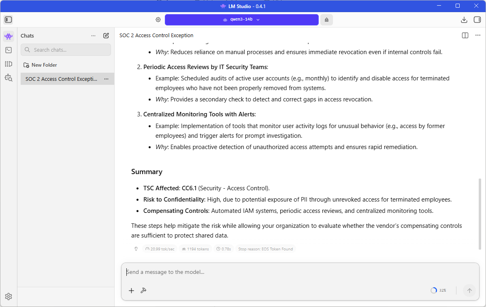
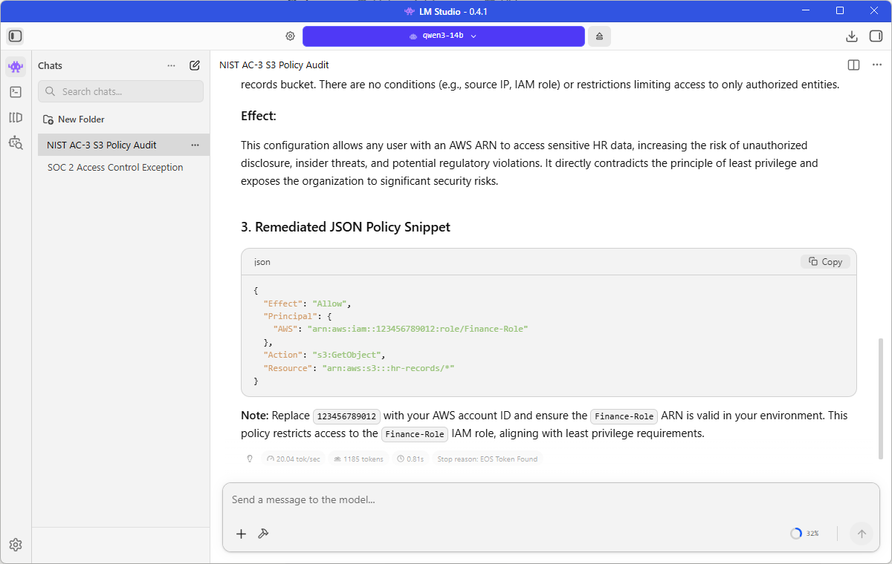
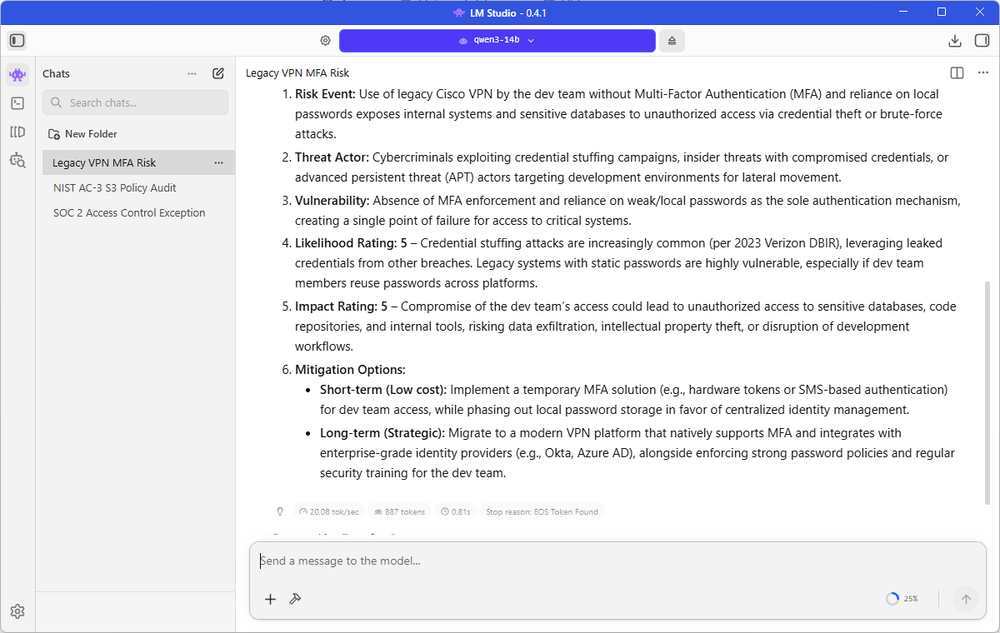

# 🔒 Offline AI Security Workstation

> Local LLM setup for GRC and Security Analyst work: threat modeling, compliance documentation, policy drafting, and incident response planning—without sending sensitive content to third-party APIs.

---

## 🎯 Project Goal

**Requirement:** Run a reasoning-capable LLM locally to support GRC/security workflows while minimizing data-exposure risk.

**Target roles:** GRC Analyst, Cybersecurity Analyst

**Primary deliverables:** Threat models, risk statements, control mappings, policy drafts, incident response checklists, vendor security questionnaires.

---

## 🖥️ System Specifications

### Hardware
- **CPU:** AMD Ryzen 7 3700X 8-Core
- **RAM:** 32GB DDR4
- **GPU:** AMD Radeon RX 6700 XT (12GB VRAM)
- **OS:** Windows 11
- **Storage:** ~10GB for model weights

### Software Stack
- **Platform:** LM Studio 0.4.1
- **Backend:** Vulkan (AMD-optimized)
- **Model:** Qwen3 14B Instruct (Q4_K_M quantization)
- **Context Window:** 32,768 tokens (expandable to 131k with YaRN—optimized at 32k for 12GB VRAM stability)
- **Performance:** 24-26 tokens/second (GPU-accelerated)

---

## 🧠 Technology Choices (Decision Documentation)

### Why I chose LM Studio (vs Jan)

I evaluated Jan and LM Studio as the two leading local LLM desktop clients. Both are strong choices for offline AI work, but I chose **LM Studio** for this specific project based on my hardware (AMD GPU) and portfolio goals.

#### Comparison

| Feature | Jan | LM Studio |
|:--------|:----|:----------|
| **License** | ✅ Open source (AGPLv3) | ❌ Proprietary |
| **Privacy approach** | ✅ Explicit: "zero data collection" | ✅ States nothing leaves device |
| **Offline documentation** | ⚠️ Privacy docs focus on cloud vs local distinction | ✅ Dedicated offline operation guide |
| **AMD GPU (Vulkan) support** | ⚠️ Supported but less documented | ✅ Well-documented, tested |
| **Ease of setup (AMD)** | ⚠️ Requires some configuration | ✅ Auto-detects Vulkan, simpler |
| **Model discovery** | Good | ✅ Excellent (integrated search/download) |
| **Community** | Growing | ✅ Larger, more AMD/Vulkan examples |

**Sources:**
- Jan Privacy Approach: https://www.jan.ai/docs/desktop/privacy
- Jan GitHub (AGPLv3): https://github.com/janhq/jan
- LM Studio Offline Docs: https://lmstudio.ai/docs/app/offline

#### Why I chose LM Studio for this project

**Decision factors:**
1. **AMD/Vulkan documentation:** LM Studio has clearer, more extensive documentation for AMD GPU setup via Vulkan, with many community examples for RX 6700 XT specifically
2. **Offline operation clarity:** LM Studio has a dedicated "Offline Operation" page that explicitly states what works offline and what doesn't, making it easy to validate for this portfolio
3. **Portfolio presentation:** The polished UI and clear hardware detection screens make better screenshots for employer review
4. **Setup speed:** For this demonstration, LM Studio's auto-detection of Vulkan and simpler configuration saved setup time

#### Why you might prefer Jan instead

**Jan's advantages:**
- ✅ **Open source:** Full code transparency (AGPLv3 license) — important if you need to audit the client code
- ✅ **Privacy-first design:** Explicit privacy documentation and "zero data collection" stance
- ✅ **Flexibility:** More control over configuration and data folder management
- ✅ **Philosophy:** If open source is a requirement (not just nice-to-have), Jan is the clear choice

**For my GRC portfolio goal** (demonstrating secure, offline AI workflows on AMD hardware), LM Studio's documentation clarity and AMD/Vulkan maturity outweighed Jan's open-source advantage. For a project specifically showcasing open-source tool selection, Jan would be the better choice.

---

### Why I chose the LM Studio Community Qwen3 GGUF

I used the **LM Studio Community** listing for Qwen3 14B because the model details clearly identify:
- Original model (Qwen3-14B by Qwen team)
- - GGUF conversion/quantization **Provenance** (bartowski)
- Runtime compatibility (llama.cpp release)

**Rationale:** For portfolio work, provenance matters. Traceable origin supports reproducibility for reviewers who want to replicate the setup.

---

### Why I chose Qwen3 14B (vs other local models)

**My constraints:**
- Hardware: AMD RX 6700 XT (12GB VRAM)
- Work type: Long-context security writing (policies, standards, IR notes) + structured outputs (tables, checklists, mappings)
- Goal: Strong instruction-following with optional deeper reasoning

**Why Qwen3 14B:**
1. **Context handling:** Supports 32k default context (up to 131k with YaRN), critical for analyzing long compliance frameworks or threat models
2. **Dual-mode operation:** Can switch between deep reasoning (default) and fast responses (`/no_think` flag)
3. **Fits my hardware:** At Q4_K_M quantization, uses ~9.5GB VRAM, leaving room for context processing

**Source:** [Qwen3-14B Model Card](https://huggingface.co/Qwen/Qwen3-14B)

**Alternatives considered:**
- Smaller models (faster, lighter) — but I prioritized long-context + reasoning for GRC writing
- Coding-specialized models — but my outputs are security narratives (controls, risks, policies) rather than pure code

---

### Why Q4_K_M quantization

**Q4_K_M** provides a practical quality/size tradeoff for consumer GPUs:
- Fits the full model in VRAM (reduces CPU/RAM spillover and latency)
- Preserves enough quality for writing, summarization, and multi-step reasoning
- Keeps throughput high (24-26 tok/sec) for iterative drafting

---

## 📋 Evidence (Proof of Execution)

### Hardware Detection (Vulkan Backend)

**What this shows:** LM Studio successfully detected my AMD Radeon RX 6700 XT with 12GB VRAM using the Vulkan backend. GPU is enabled and ready for inference.

---

### Reasoning Mode Output (Threat Modeling)

**What this shows:**
- **Prompt:** "Write a one-sentence threat model for a web API that handles user authentication"
- **Thinking time:** 16.56 seconds (model reasoning before output)
- **Generation speed:** 24.95 tokens/second
- **Output:** Comprehensive threat analysis identifying SQLi, brute-force, and token exposure risks

---

### Fast Mode Output (`/no_think`)

**What this shows:**
- **Prompt:** "Write a one-sentence summary of NIST 800-53 /no_think"
- **Total time:** 0.87 seconds (instant response)
- **Generation speed:** 26.22 tokens/second
- **Output:** Accurate summary with no pre-thinking delay

---

**Measured results summary:**
- **VRAM usage:** 9.5GB / 12GB during inference
- **Reasoning mode:** 24.95 tok/sec (with 10-20s thinking)
- **Fast mode:** 26.22 tok/sec (instant)

---

## 🛠️ Setup Guide (Step-by-Step)

### Prerequisites
* **OS:** Windows 10/11 (or Linux)
* **Hardware:** AMD GPU with 8GB+ VRAM (via Vulkan) or NVIDIA (via CUDA)
* **Storage:** 20GB free disk space

### 1. Install & Configure LM Studio
1. **Install:** Download from [lmstudio.ai](https://lmstudio.ai).
2. **GPU Setup:** Go to **Settings (⚙️) → Hardware**. Toggle **GPU ON** and verify detection via **Vulkan**.
3. **Model Download:** Search for `Qwen3 14B` and select `lmstudio-community/Qwen3-14B-GGUF`. Download the `Q4_K_M` version.
4. **Load Model:** Click the **Chat icon (💬)**, select the model at the top, and wait for the "Active" status.

### 2. Maximize Performance
In the **Model Settings** panel:
* **GPU Offload:** Set to **MAX** (40/40 for Qwen3 14B).
* **Context Length:** Set to `32768`.
* **Hardware Check:** Verify VRAM usage is ~9-10GB in the resource monitor (not system RAM).

---

## 🔐 Privacy & Compliance Advantages

Using a local LLM shifts the security model from **Third-Party Risk Management** to **Internal Endpoint Control**.

| Framework | Primary Benefit | The Analyst's View (Implementation) |
| :--- | :--- | :--- |
| **HIPAA** | No PHI/PII sent to third parties; No BAA required. | Requires local Full Disk Encryption (FDE) and strict local access controls. |
| **PCI-DSS** | Scope Reduction; keeps CHD analysis out of the cloud. | Workstation enters the CDE; must follow hardening and logging standards. |
| **SOC 2** | Simplifies Vendor Management; no AI-vendor audit required. | The LLM becomes a managed internal asset within your SOC 2 boundary. |
| **GDPR** | Zero Cross-Border Transfer; absolute data residency. | Simplifies "Right to Erasure" (RTBF) as logs are stored on-premises. |

> [!IMPORTANT]
> **🔒 Security Note on Local Deployment:**
> While local LLMs mitigate third-party exposure, the "Security **OF** the AI" becomes the responsibility of the host. In this project, I treat the workstation as a **High-Trust Asset**, assuming Full Disk Encryption (AES-256) is active and network isolation is used for sensitive sessions.

---

## 💼 GRC & Security Use Cases

This workstation allows for "Senior Analyst" level workflows without data leakage. Below are validated use cases with actual output examples.

### 📚 Expert Prompt Library
I have compiled a library of high-fidelity prompts that demonstrate how to use this workstation for complex GRC tasks.
👉 **[View the GRC Prompt Library (PROMPT_LIBRARY.md)](PROMPT_LIBRARY.md)**

---

### 1️⃣ SOC 2 Technical Exception Analysis
**Prompt:**
> "Act as a Senior GRC Analyst. I am reviewing a vendor's SOC 2 Type II report. The auditor noted an exception: 'For 3 out of 25 samples, the vendor could not provide evidence of timely access revocation...'"

**Value:** Translates "Auditor-speak" into concrete risk assessments and mapped Trust Services Criteria (TSC).

*Figure 1: Local Qwen3 14B model identifying TSC gaps and compensating controls.*

---

### 2️⃣ Technical Compliance Audit (NIST 800-53)
**Prompt:**
> "Context: I am auditing our cloud environment against NIST 800-53 AC-3. Analyze this S3 Bucket Policy..."

**Value:** Instantly detects "Least Privilege" violations in raw JSON/config files and generates remediation code.

*Figure 2: AI identifying a public S3 bucket and writing the fix (JSON).*

---

### 3️⃣ Quantitative Risk Assessment
**Prompt:**
> "Generate a formal Risk Statement for the following finding: 'Our legacy Cisco VPN used by the dev team does not support MFA...'"

**Value:** Standardizes risk register entries with professional, neutral language and calculated likelihood/impact ratings.

*Figure 3: Structured risk entry ready for GRC platforms (ServiceNow/Archer).*

---

## 📊 Job Relevance (Security Analyst / GRC)

This project demonstrates the following professional competencies:

| Competency | Evidence in Project |
|---|---|
| **Technical Architecture** | Configured Vulkan/GPU acceleration and optimized VRAM for 24+ tok/sec local inference. |
| **Risk-Based Decision Making** | Selected offline LLMs to mitigate third-party data leakage risks for sensitive IR and policy work. |
| **Security Documentation** | Created reproducible, well-documented technical workflows and prompt libraries. |
| **Tool Proficiency** | Demonstrated mastery of local AI tooling (LM Studio) and modern reasoning models (Qwen3). |

---

## 🎓 Why This Matters

**The "Why":**  
> "I built this to solve the 'AI Privacy Paradox'—leveraging the productivity of LLMs for GRC tasks without the risk of data leakage to third-party providers."

**The Metrics:**  
> "Optimized for **24–26 tokens/sec** on AMD hardware using Vulkan, ensuring zero-latency offline operation."

**The Strategy:**  
> "By using local RAG (Retrieval-Augmented Generation), I can analyze internal policies against frameworks like NIST or SOC 2 without the data ever leaving the encrypted local environment."

---

## ⚖️ License & Professional Disclaimer

**License:** MIT | **Model:** Qwen3 (Apache 2.0)

> [!CAUTION]
> **Human-in-the-Loop (HITL) Requirement**
> This workstation is a **decision-support tool**, not a decision-maker. In accordance with NIST AI RMF and industry best practices, all AI-generated outputs (risk statements, control mappings, or policy drafts) must be reviewed, validated, and signed off by a qualified human professional.

### 1. Hallucination & Accuracy Warning
Large Language Models (LLMs) can "hallucinate" or provide factually incorrect information, including citing non-existent regulatory sub-clauses or misinterpreting framework overlaps (e.g., NIST to ISO crosswalks). **Always verify citations against official source text** (e.g., NIST CSRC, ISO.org, or the SEC/OCC/HHS portals).

### 2. Professional Accountability
The use of this tool does not shift the burden of accountability. The human analyst remains the **Risk Owner**. Any security failures or compliance gaps resulting from unverified AI guidance are the sole responsibility of the analyst and their organization.

### 3. No Legal or Regulatory Advice
Outputs from this workstation do not constitute legal advice, formal audit opinions, or guaranteed regulatory compliance. This project is for **demonstration and productivity enhancement purposes** only.

### 4. Local Data Security
While this setup mitigates third-party "data-in-flight" risk, the user is responsible for "data-at-rest" security. Ensure the host machine utilizes Full Disk Encryption (FDE), strictly managed access controls, and periodic log reviews to maintain the integrity of the local GRC environment.

---

**Last Updated:** February 4, 2026
